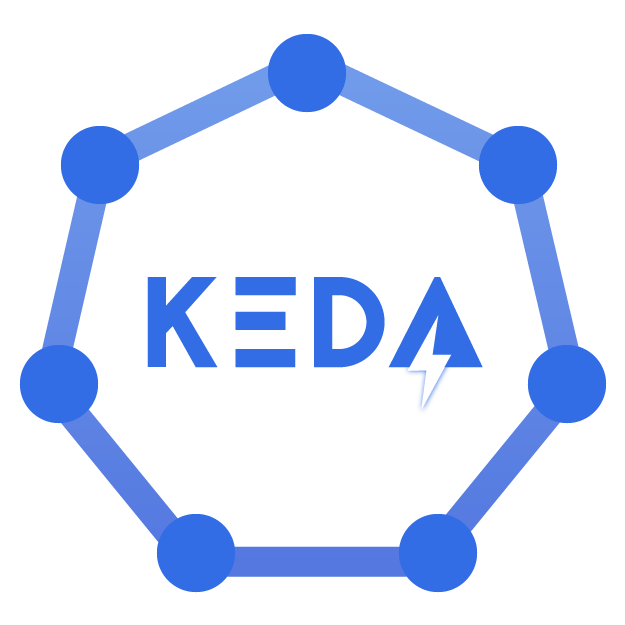
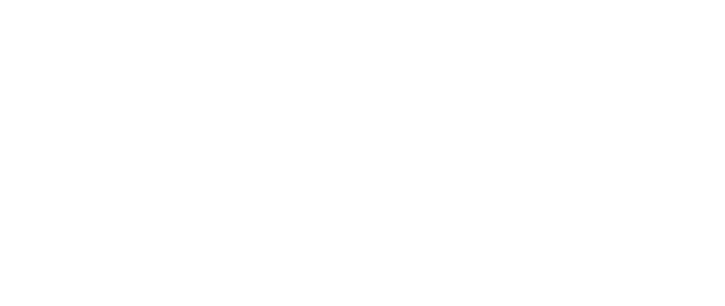
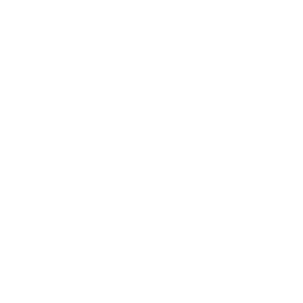
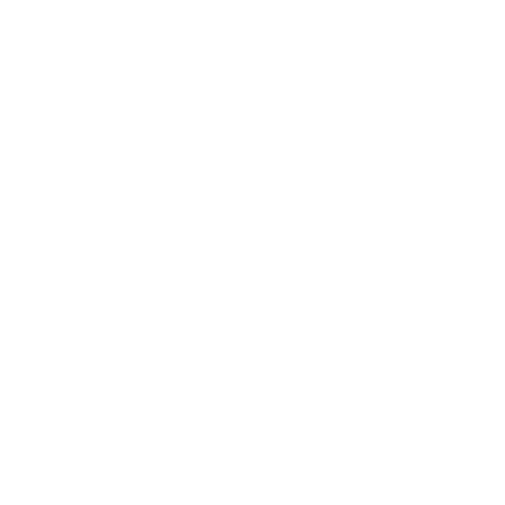
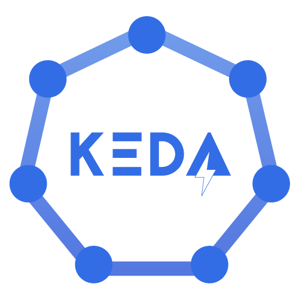
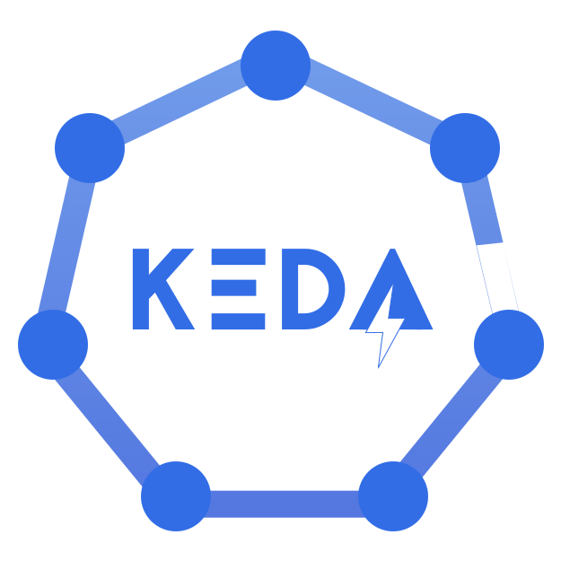

# Branding

Kubernetes-based Event Driven Autoscaling is a CNCF Sandbox project and follows to the [CNCF/LF trademark usage](https://www.linuxfoundation.org/trademark-usage/).

When referring to Kubernetes-based Event Driven Autoscaling in short, it should be called "KEDA" with full upper-casing.

## Logos

We provide various logos to use for both online & print usage:

<table>
    <tr>
        <th colspan="7"></th>
    </tr>
    <tr>
        <th></th>
        <th colspan="3">PNG</th>
        <th colspan="3">SVG</th>
    </tr>
    <tr>
        <th></th>
        <th></th>
        <th>Horizontal</th>
        <th>Icon</th>
        <th>Horizontal</th>
        <th>Icon</th>
    </tr>
    <tr>
        <th rowspan="3">Online</th>
        <th>Color</th>
        <td></td>
        <td></td>
        <td></td>
        <td></td>
    </tr>
    <tr>
        <th>Black</th>
        <td></td>
        <td></td>
        <td></td>
        <td></td>
    </tr>
    <tr>
        <th>White</th>
        <td></td>
        <td></td>
        <td></td>
        <td></td>
    </tr>
    <tr>
        <th colspan="2">Print</th>
        <td></td>
        <td></td>
        <td></td>
        <td></td>
    </tr>
    </table>

 They can also be found on the [official CNCF Artwork](https://github.com/cncf/artwork/blob/master/examples/sandbox.md#keda-logos) page.
