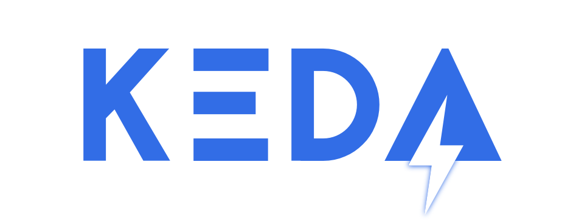
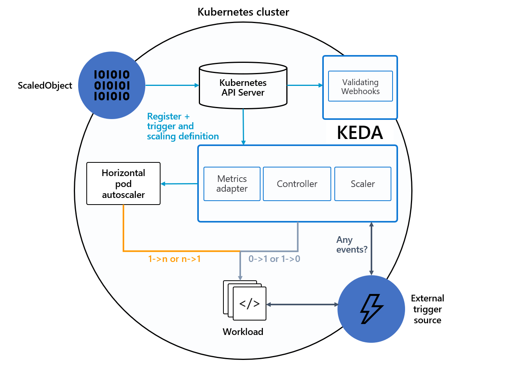
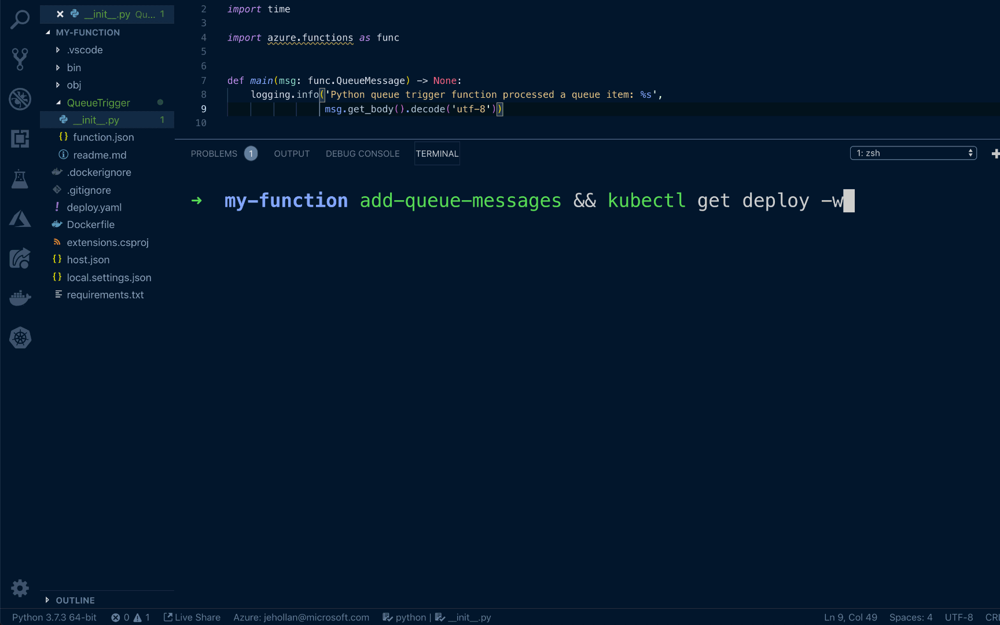

[](https://github.com/kedacore/keda/actions)


<p align="center"></p>
<p style="font-size: 25px" align="center"><b>Kubernetes-based Event Driven Autoscaling</b></p>

KEDA allows for fine grained autoscaling (including to/from zero) for event driven Kubernetes workloads.  KEDA serves as a Kubernetes Metrics Server and allows users to define autoscaling rules using a dedicated Kubernetes custom resource definition.

KEDA can run on both the cloud and the edge, integrates natively with Kubernetes components such as the Horizontal Pod Autoscaler, and has no external dependencies.

:loudspeaker: **Experimental Phase** - *Please note this software is experimental and should not be used for anything resembling a production workload.  We want to create KEDA in the open with the community to bring event driven scale to Kubernetes.*

---
<p align="center">
In partnership with
</p>
<p align="center">

  </p>

---

## Getting started

* [QuickStart - RabbitMQ and Go](https://github.com/kedacore/sample-go-rabbitmq)
* [QuickStart - Azure Functions and Queues](https://github.com/kedacore/sample-hello-world-azure-functions)
* [QuickStart - Azure Functions and Kafka on Openshift 4](https://github.com/kedacore/keda/wiki/Using-Keda-and-Azure-Functions-on-Openshift-4)

## FAQ

You can find a [FAQ here](https://github.com/kedacore/keda/wiki/FAQ) with some common questions.

## Samples

You can find several samples for various event sources [here](https://github.com/kedacore/samples)

## Setup

### Deploying with a Helm chart

#### Add Helm repo
```cli
helm repo add kedacore https://kedacore.azureedge.net/helm
```

#### Update Helm repo
```cli
helm repo update
```

#### Install keda-edge chart
```cli
helm install kedacore/keda-edge --devel --set logLevel=debug --namespace keda --name keda
```

#### Install keda-edge chart with ARM image
```cli
helm install kedacore/keda-edge --devel --set logLevel=debug --namespace keda --name keda --set image.tag=arm
```

### Deploying with the [Azure Functions Core Tools](https://github.com/Azure/azure-functions-core-tools)
```
func kubernetes install --namespace keda
```

### Deploying using the deploy yaml
If you want to try KEDA on minikube or a different Kubernetes deployment without using Helm, you can deploy CRD and yamls under the `/deploy` directory.
```
kubectl create namespace keda
kubectl apply -f deploy/crds/keda.k8s.io_scaledobjects_crd.yaml
kubectl apply -f deploy/crds/keda.k8s.io_triggerauthentications_crd.yaml
kubectl apply -f deploy/
```

## How KEDA works

KEDA performs two key roles within Kubernetes.  First, it acts as an agent to activate and deactivate a deployment to scale to and from zero on no events.  Second, it acts as a [Kubernetes metrics server](https://kubernetes.io/docs/tasks/run-application/horizontal-pod-autoscale/#support-for-custom-metrics) to expose rich event data like queue length or stream lag to the horizontal pod autoscaler to drive scale out.  It is up to the deployment to then consume the events directly from the source.  This preserves rich event integration and enables gestures like completing or abandoning queue messages to work out of the box.

<p align="center"></p>

### Event sources and scalers

KEDA has a number of "scalers" that can both detect if a deployment should be activated or deactivated, and feed custom metrics for a specific event source.  Today there is scaler support for:

* AWS CloudWatch
* AWS Simple Queue Service
* Azure Event Hub†
* Azure Service Bus Queues and Topics
* Azure Storage Queues
* GCP PubSub
* Kafka
* Liiklus
* Nats Streaming
* Prometheus
* RabbitMQ
* Redis Lists

You can view other planned scalers [in our wiki and issue backlog](https://github.com/kedacore/keda/wiki/Scaler-prioritization).

_†: As of now, the Event Hub scaler only supports reading from Blob Storage, as well as scaling only Event Hub applications written in C#, Python or created with Azure Functions._

#### ScaledObject custom resource definition

In order to sync a deployment with an event source, a `ScaledObject` custom resource needs to be deployed. `ScaledObjects` contain information on the deployment to scale, metadata on the event source (e.g. connection string secret, queue name), polling interval, and cooldown period. The `ScaledObject` will result in corresponding autoscaling resource (HPA definition) to scale the deployment. When `ScaledObjects` get deleted, the corresponding HPA definition is cleaned up.

ScaledObject examples and schemas [can be found here](https://github.com/kedacore/keda/tree/master/spec).

### HTTP scaling integration

KEDA enables scaling based on event sources where the event resides somewhere to be pulled.  For events like HTTP where the event is pushed to the container, KEDA works side by side with HTTP scale-to-zero components like [Osiris](https://github.com/deislabs/osiris) or [Knative serving](https://github.com/knative/serving).  By pairing KEDA with an HTTP scale-to-zero component you can provide rich event scaling for both HTTP and non-HTTP.

### Azure Functions Integration

While KEDA can be used with any container or deployment, the Azure Functions tooling natively integrates with KEDA for a seamless developer experience and event-driven programming model.  With functions, developers only need to write the code that should run on an event, and not have to worry about the event consuming scaffolding.  [Azure Functions is open source](https://github.com/azure/azure-functions-host), and all of the existing tooling and developer experience works regardless of the hosting option.

You can containerize and deploy an existing or new Azure Function using the [Azure Functions core tools](https://github.com/azure/azure-functions-core-tools)

```cli
func kubernetes deploy --name my-function --registry my-container-registry
```

<p></p>

[Using Azure Functions with KEDA and Osiris](https://github.com/kedacore/keda/wiki/Using-Azure-Functions-with-Keda-and-Osiris)


## Community Standup

If interested in contributing or participating in the direction of KEDA, you can join our community meetings.

Meeting time: Weekly Thurs 17:00 UTC. [Convert to your timezone](https://www.thetimezoneconverter.com/?t=17:00&tz=UTC).
Zoom link: [https://zoom.us/j/150360492 ](https://zoom.us/j/150360492 )
Meeting agenda: [https://hackmd.io/s/r127ErYiN](https://hackmd.io/s/r127ErYiN)

## Building
This project is using [Operator SDK framework](https://github.com/operator-framework/operator-sdk) v0.11.0.

```bash
git clone git@github.com:kedacore/keda.git
cd keda
make build
```

# Contributing

This project welcomes contributions and suggestions.  Most contributions require you to agree to a
Contributor License Agreement (CLA) declaring that you have the right to, and actually do, grant us
the rights to use your contribution. For details, visit https://cla.microsoft.com.

When you submit a pull request, a CLA-bot will automatically determine whether you need to provide
a CLA and decorate the PR appropriately (e.g., label, comment). Simply follow the instructions
provided by the bot. You will only need to do this once across all repos using our CLA.

This project has adopted the [Microsoft Open Source Code of Conduct](https://opensource.microsoft.com/codeofconduct/).
For more information see the [Code of Conduct FAQ](https://opensource.microsoft.com/codeofconduct/faq/) or
contact [opencode@microsoft.com](mailto:opencode@microsoft.com) with any additional questions or comments.
