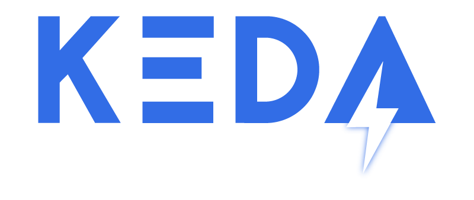

<b>Kubernetes-based Event Driven Autoscaling</b>

KEDA allows for fine-grained autoscaling (including to/from zero) for event driven Kubernetes workloads. KEDA serves
as a Kubernetes Metrics Server and allows users to define autoscaling rules using a dedicated Kubernetes custom
resource definition.

KEDA can run on both the cloud and the edge, integrates natively with Kubernetes components such as the Horizontal
Pod Autoscaler, and has no external dependencies.

We are a Cloud Native Computing Foundation (CNCF) sandbox project.

<!-- START doctoc generated TOC please keep comment here to allow auto update -->
<!-- DON'T EDIT THIS SECTION, INSTEAD RE-RUN doctoc TO UPDATE -->
**Table of contents**

- [Getting started](#getting-started)
  - [Deploying KEDA](#deploying-keda)
- [Documentation](#documentation)
- [Governance & Policies](#governance--policies)
- [Community](#community)
  - [Become a listed KEDA user!](#become-a-listed-keda-user)
- [Releases](#releases)
- [Contributing](#contributing)
  - [Building & deploying locally](#building--deploying-locally)

<!-- END doctoc generated TOC please keep comment here to allow auto update -->

## Getting started

* [QuickStart - RabbitMQ and Go](https://github.com/kedacore/sample-go-rabbitmq)
* [QuickStart - Azure Functions and Queues](https://github.com/kedacore/sample-hello-world-azure-functions)
* [QuickStart - Azure Functions and Kafka on Openshift 4](https://github.com/kedacore/sample-azure-functions-on-ocp4)
* [QuickStart - Azure Storage Queue with ScaledJob](https://github.com/kedacore/sample-go-storage-queue)

You can find several samples for various event sources [here](https://github.com/kedacore/samples).

### Deploying KEDA

There are many ways to [deploy KEDA including Helm, Operator Hub and YAML files](https://keda.sh/docs/latest/deploy/).

## Documentation

Interested to learn more? Head over to [keda.sh](https://keda.sh).

## Governance & Policies

You can learn about the governance of KEDA [here](https://github.com/kedacore/governance).

## Community

If interested in contributing or participating in the direction of KEDA, you can join our community meetings.

* **Meeting time:** Bi-weekly Tues 16:00 UTC (does follow US daylight savings).
([Subscribe to Google Agenda](https://calendar.google.com/calendar?cid=bjE0bjJtNWM0MHVmam1ob2ExcTgwdXVkOThAZ3JvdXAuY2FsZW5kYXIuZ29vZ2xlLmNvbQ) |
 [Convert to your timezone](https://www.thetimezoneconverter.com/?t=04%3A00%20pm&tz=UTC))
* **Zoom link:** [https://us02web.zoom.us/j/150360492?pwd=eUVtQzBPMzFoQUR2K1dqUWhENjJJdz09](https://us02web.zoom.us/j/150360492?pwd=eUVtQzBPMzFoQUR2K1dqUWhENjJJdz09)  (Password: keda)
* **Meeting agenda:** [https://hackmd.io/s/r127ErYiN](https://hackmd.io/s/r127ErYiN)

Just want to learn or chat about KEDA? Feel free to join the conversation in
**[#KEDA](https://kubernetes.slack.com/messages/CKZJ36A5D)** on the **[Kubernetes Slack](https://slack.k8s.io/)**!

### Become a listed KEDA user!

We are always happy to [list users](https://keda.sh/community/#users) who run KEDA in production, learn more about it [here](https://github.com/kedacore/keda-docs#become-a-listed-keda-user).

## Releases

You can find the latest releases [here](https://github.com/kedacore/keda/releases).

## Contributing

You can find contributing guide [here](./CONTRIBUTING.md).

### Building & deploying locally
Learn how to build & deploy KEDA locally [here](./BUILD.md).
