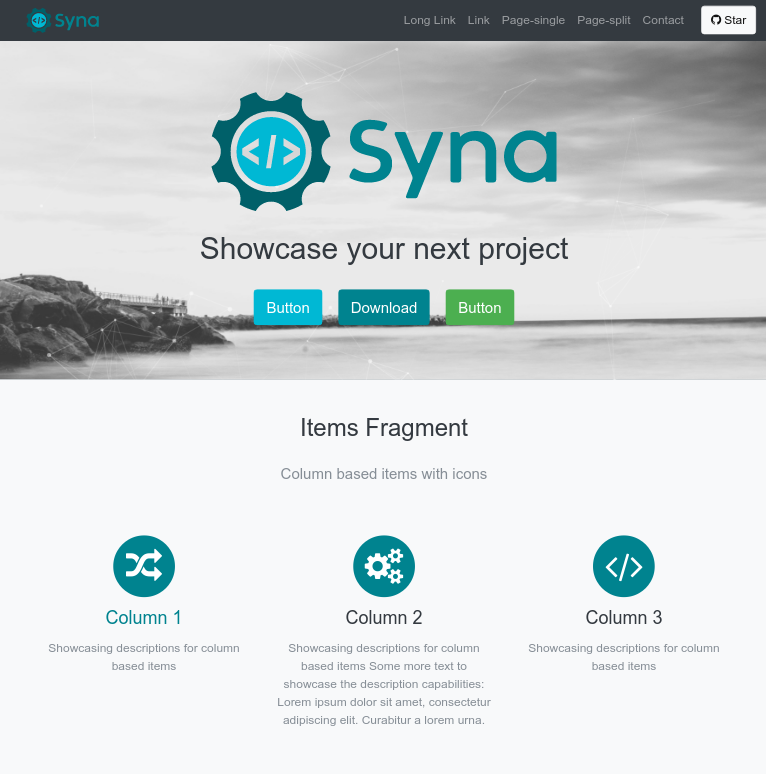

+++
fragment = "content"
weight = 100
#background = ""

title = "Lorem Ipsum is the single greatest threat"
#subtitle = ""
title_align = "left"

display_date = true

[sidebar]
  align = "right"

[asset]
  image = "image.png"
+++

Lorem Ipsum is the single greatest threat. We are not - we are not keeping up with other websites. You're telling the enemy exactly what you're going to do. No wonder you've been fighting Lorem Ipsum your entire adult life. Lorem Ipsum's father was with Lee Harvey Oswald prior to Oswald's being, you know, shot.

You're telling the enemy exactly what you're going to do. No wonder you've been fighting Lorem Ipsum your entire adult life. I think my strongest asset maybe by far is my temperament. I have a placeholding temperament. Lorem Ipsum's father was with Lee Harvey Oswald prior to Oswald's being, you know, shot. You’re disgusting.

You're telling the enemy exactly what you're going to do. No wonder you've been fighting Lorem Ipsum your entire adult life.

Lorem Ipsum is **FAKE TEXT**! I think the only card she has is the Lorem card. I write the best placeholder text, and I'm the biggest developer on the web by far... While that's mock-ups and this is politics, are they really so different?

My text is long and beautiful, as, it has been well documented, are various other parts of my website. My text is long and beautiful, as, it has been well documented, are various other parts of my website. I don't think anybody knows it was Russia that wrote Lorem Ipsum, but I don't know, maybe it was. It could be Russia, but it could also be China. It could also be lots of other people. It also could be some wordsmith sitting on their bed that weights 400 pounds. Ok? My placeholder text, I think, is going to end up being very good with women.
