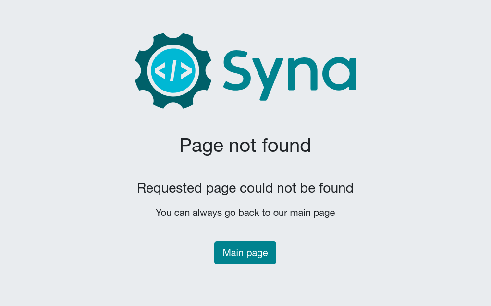

+++
fragment = "content"
weight = 100

title = "404"
+++

Call to action and description for the 404 (page not found) page

<!--more-->

Simple fragment with an image (usually logo of the website), a description and a
call to action button. This fragment should be located inside the global
fragments directory and is only rendered in the 404 page.

Since 404 fragment can not be rendered in normal pages, the following is a
screenshot.

